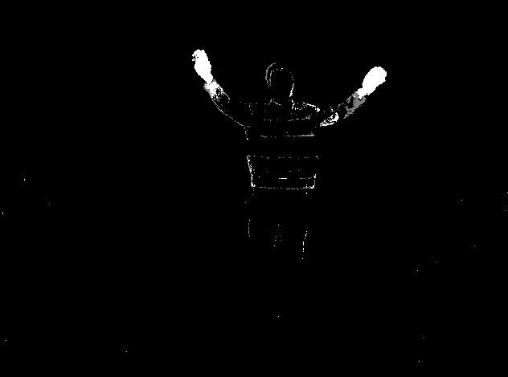
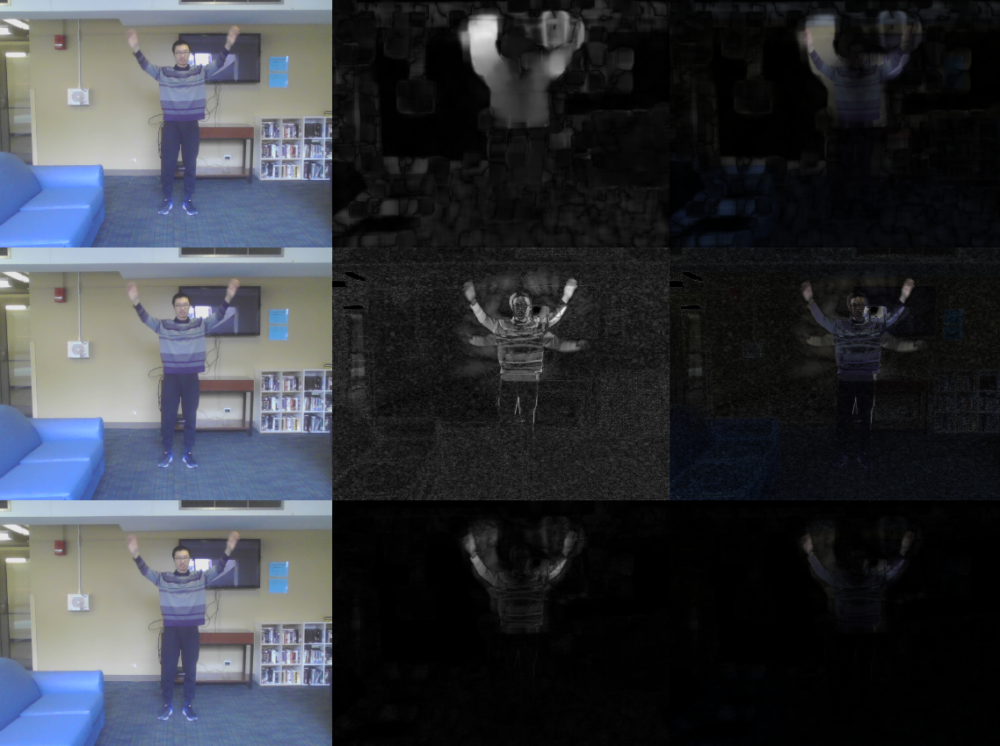

A test of  
getting the mask of moving objects （in Python3）.  

1. cv2_bg_subtractraction.py:   
A copy of the opencv's background subtraction (bg-sub) algorithm.

2. my_bg_sub_and_optical_flow.py:
It's my experiment.  
Use optical flow to get MASK1.  
Use a very simple bg-sub to get MASK2.  
Then combine the MASK1 & MASK2 to get the final mask of the moving objects.  

Result:
cv2's result is far better (also faster) than mine.  
It can be combined with OpenPose to detect the moving hand !!! Great.

Result images:
1. cv2:  

2. my:  
The 1st row is by optical flow.  
The 2nd row is by background subtraction.  
The 3nd row combines the two.    
  
